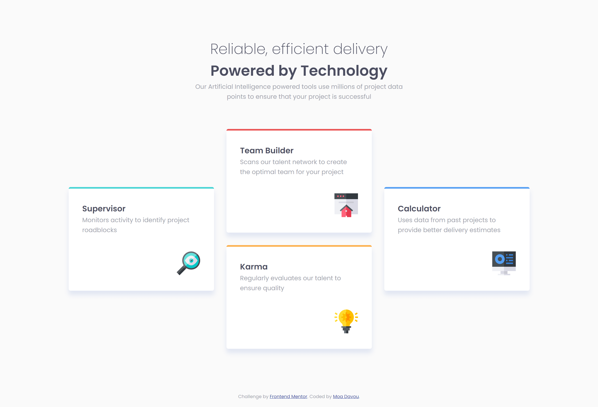

# Frontend Mentor - Four card feature section solution

This is a solution to the [Four card feature section challenge on Frontend Mentor](https://www.frontendmentor.io/challenges/four-card-feature-section-weK1eFYK). Frontend Mentor challenges help you improve your coding skills by building realistic projects.

## Table of contents

- [Overview](#overview)
  - [The challenge](#the-challenge)
  - [Screenshot](#screenshot)
  - [Links](#links)
- [My process](#my-process)
  - [Built with](#built-with)
  - [What I learned](#what-i-learned)
  - [Feedback](#feedback)
  - [Continued development](#continued-development)
- [Author](#author)

## Overview

### The challenge

Users should be able to:

- View the optimal layout for the site depending on their device's screen size

### Screenshot

### Links

- Repository URL: [GitHub](https://github.com/moadavou/four-card-feature-section)
- Live Site URL: [GitHub Pages](https://moadavou.github.io/four-card-feature-section/)

## My process

### Built with

- Semantic HTML5 markup
- CUBE CSS
- CSS Grid
- Mobile-first workflow

### What I learned

This project involved a lot of practicing what I already knew, which is always a valuable experience. However, I did manage to learn something new.

- I practiced using `grid` more. I'm less confident with it compared to `flexbox`. I had some layout issues because I forgot about `place-items: center;`. Managed to figure it out in the end!

- I also learned how to use the `data-*` attribute to write shorter and cleaner CSS.

### Feedback

After completing the challenge, I received valuable feedback and had discussions with other Frontend Mentor users about semantic HTML.

**The updates I made to the challenge after receiving feedback:**

- I updated the cards to use the `<article>` element instead of the `
` element since they can be used as standalone content.
- I updated the grid to 4 rows and 3 columns. This change ensures that the cards will have consistent lengths, regardless of the content inside them.
- I added a `min-height: 100vh` on larger devices to ensure that the content is centered on the page.

**My conclusion from our discussions:**

**Using `<h1>` inside `<header>`**

Even though multiple websites state that `<header>` can contain `<h1>` (it's not a compliance failure under WCAG accessibility requirements), they shouldn't.

- `<header>` is a _banner_ role landmark, which is designed to hold repeating content across a site.
- If a banner `<header>` with a `<h1>` is on every page, the `<h1>` no longer acts as a page heading due to it being perceived as repeated content. This is bad for SEO.
- It can cause misordering of heading elements which is confusing for screen readers and goes against WCGA best recommendations.

Another thing to note is that having multiple `<header>` elements on a page should be avoided. This makes some screen reader users hear multiple _banner_ landmarks.

**Text inside `` or `
`**

`
` and `` have no semantic value. If semantic elements are used to give them semantic value, text can be used inside them. For example:

`
I'm a spanI'm not a span
`

Avoid standalone `
` and ``. For example, this is considered bad (due to no semantic value):

`I'm a span`

**Make sure to use the most meaningful elements for the content.**

- If you need bold text, use `<strong>` or `<bold>`
- If you need italics, use `<em>` or `<i>`
- If you need strikethrough, use `<del>` or `<s>`

Only use `` if there are **no meaningful elements you can use**.

### Continued development

I want to become more comfortable with `grid` and the `data-*` attribute.

## Author

- Frontend Mentor - [@moadavou](https://www.frontendmentor.io/profile/moadavou)
- GitHub - [@moadavou](https://github.com/moadavou)
