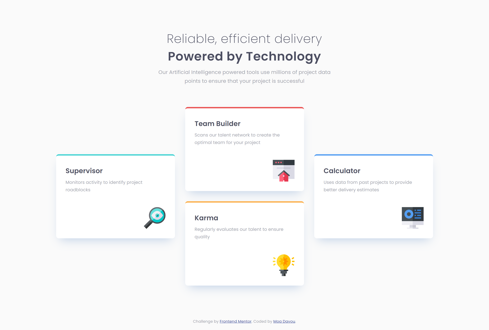

# Frontend Mentor - Four card feature section solution

This is a solution to the [Four card feature section challenge on Frontend Mentor](https://www.frontendmentor.io/challenges/four-card-feature-section-weK1eFYK). Frontend Mentor challenges help you improve your coding skills by building realistic projects.

## Table of contents

- [Overview](#overview)
  - [The challenge](#the-challenge)
  - [Screenshot](#screenshot)
  - [Links](#links)
- [My process](#my-process)
  - [Built with](#built-with)
  - [What I learned](#what-i-learned)
  - [Continued development](#continued-development)
- [Author](#author)

## Overview

### The challenge

Users should be able to:

- View the optimal layout for the site depending on their device's screen size

### Screenshot

### Links

- Repository URL: [GitHub](https://github.com/moadavou/four-card-feature-section)
- Live Site URL: [GitHub Pages](https://moadavou.github.io/four-card-feature-section/)

## My process

### Built with

- Semantic HTML5 markup
- CSS custom properties
- CSS utility classes
- Flexbox
- CSS Grid
- Mobile-first workflow

### What I learned

This project was a lot of practicing what I already knew (which is always a good experience). But, as always, I did learn something new.

- I got some more practice with `grid`. Compared to `flexbox` I'm not confident with this one. I had some issues with the layout since I completely forgot that `place-items: center;` exists. Got there in the end!

- I also learned how to use the `data-*` attribute to write shorter and cleaner CSS.

### Continued development

I want to become more comfortable with `grid` and the `data-*` attribute.

## Author

- Frontend Mentor - [@moadavou](https://www.frontendmentor.io/profile/moadavou)
- GitHub - [@moadavou](https://github.com/moadavou)
